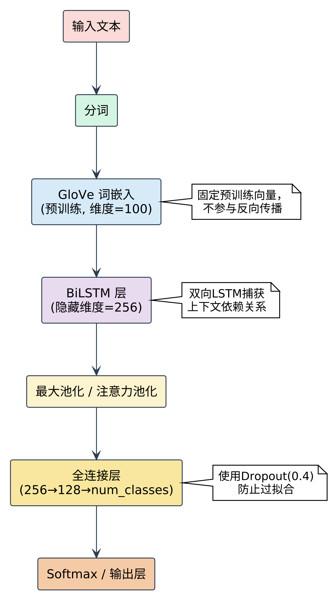
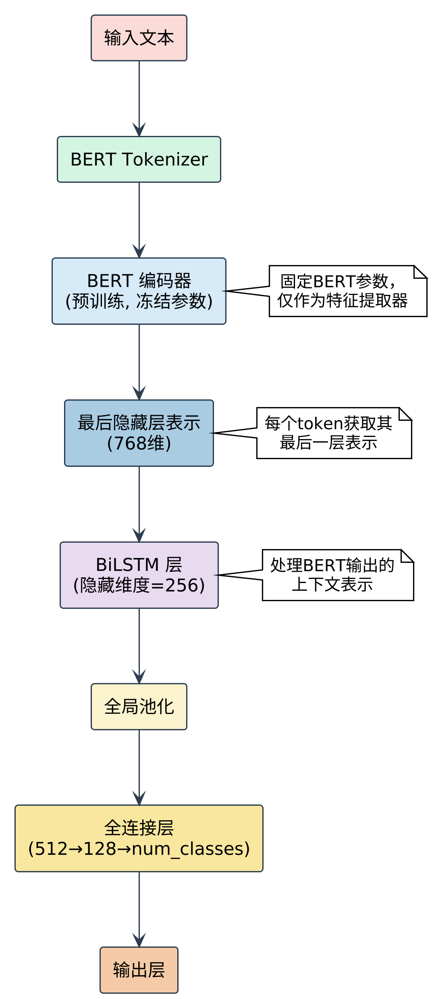
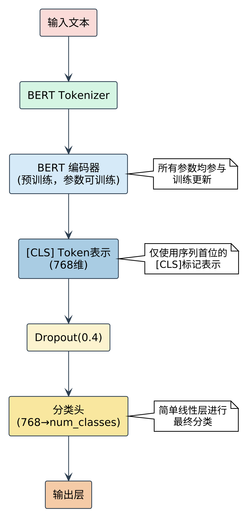

# 基于深度学习的自然语言处理任务实现


本项目是2025年春季《自然语言处理》课程的期末综合设计，实现了两个经典的NLP任务：多分类情感分析和自然语言推理。每个任务均基于深度学习方法，使用不同的模型架构实现并比较其性能。

## 项目结构

```
.
├── doc/                    # 项目文档
│   └── Todo.md             # 任务说明
├── task1/                  # 情感分析任务
│   ├── data/               # IMDB-10数据集
│   ├── glove/              # GloVe词向量
│   ├── bert-base-uncased/  # BERT预训练模型
│   ├── outputs/            # 训练输出结果
│   ├── data_loader.py      # 数据加载模块
│   ├── models.py           # 模型定义
│   ├── train.py            # 训练流程
│   ├── evaluate.py         # 评估模块
│   ├── main.py             # 主程序
│   └── README.md           # 任务1说明
└── task2/                  # 自然语言推理任务
    ├── data/               # SNLI数据集
    ├── outputs/            # 训练输出结果
    ├── data_loader.py      # 数据加载模块
    ├── models.py           # 模型定义
    ├── train.py            # 训练流程
    ├── evaluate.py         # 评估模块
    ├── main.py             # 主程序
    └── README.md           # 任务2说明
```

## 任务概述

### 任务一：多分类情感分析

基于IMDB-10数据集（电影评论的十分类情感标注，评分1-10）实现深度学习模型，对电影评论进行情感强度分类。

**评价指标**：
- 宏平均F1值（Macro-F1，主要指标）
- 准确率（Accuracy）
- 均方根误差（RMSE）

**实现模型**：
- GloVe + BiLSTM
- BERT（词向量层）+ BiLSTM
- BERT 下游任务精调模型

### 任务二：自然语言推理

基于Stanford Natural Language Inference (SNLI)数据集实现自然语言推理任务，识别前提(Premise)和假设(Hypothesis)之间的推理关系。

**标签类别**：
- `0 (Entailment)`：前提可推断假设
- `1 (Neutral)`：其他情况  
- `2 (Contradiction)`：前提与假设矛盾

**评价指标**：
- 宏平均F1值（Macro-F1，主要指标）
- 准确率（Accuracy）

**实现模型**：
- GloVe + BiLSTM
- BERT（词向量层）+ BiLSTM
- BERT 下游任务精调模型

## 环境配置

每个任务目录下都有`setup.sh`脚本用于配置运行环境：

```bash
# 为任务一配置环境
cd task1
bash setup.sh

# 为任务二配置环境
cd task2
bash setup.sh
```

主要依赖：
- PyTorch
- Transformers
- scikit-learn
- pandas
- matplotlib
- tqdm
- pyarrow (任务二)

## 运行指南

### 任务一：情感分析

```bash
cd task1

# 运行GloVe + BiLSTM模型
python main.py --model glove_bilstm --epochs 10 --batch_size 32 --lr 1e-3 --glove_dim 100

# 运行BERT + BiLSTM模型
python main.py --model bert_bilstm --epochs 5 --batch_size 16 --lr 5e-4

# 运行BERT微调模型
python main.py --model bert_fine_tuning --epochs 3 --batch_size 16 --lr 1e-5
```

### 任务二：自然语言推理

```bash
cd task2

# 运行GloVe + BiLSTM模型
python main.py --model glove_bilstm --epochs 10 --batch_size 32 --lr 1e-3 --glove_dim 100

# 运行BERT + BiLSTM模型
python main.py --model bert_bilstm --epochs 5 --batch_size 16 --lr 5e-4

# 运行BERT微调模型
python main.py --model bert_fine_tuning --epochs 3 --batch_size 16 --lr 1e-5
```

## 模型架构

### GloVe + BiLSTM
将文本通过预训练的GloVe词向量转化为词嵌入，使用多层双向LSTM处理序列特征，最后通过全连接层进行分类。



### BERT + BiLSTM
使用BERT作为特征提取器（冻结参数），获取BERT最后一层的隐藏状态，然后通过BiLSTM进一步处理，最后进行分类。



### BERT 微调
直接对预训练的BERT模型进行微调，使用[CLS]标记的表示进行分类任务。



## 实验结果

### 任务一：情感分析

| Model               | 准确率 (%) | 宏 F1 值 | RMSE   |
|--------------------|------------|----------|--------|
| GloVe + BiLSTM     | 37.94      | 0.2640   | 1.5580 |
| BERT + BiLSTM      | 43.42      | 0.3790   | 1.3377 |
| BERT Fine-Tuning   | 47.01      | 0.4233   | 1.3285 |

### 任务二：自然语言推理

| Model | Accuracy | Macro-F1 |
|------|----------|----------|
| GloVe + BiLSTM |  |  |
| BERT + BiLSTM |  |  |
| BERT 微调 |  |  |

## 结论

1. 三种模型性能比较：BERT微调 > BERT+BiLSTM > GloVe+BiLSTM
2. 预训练语言模型(BERT)在处理复杂语义理解任务上明显优于传统词向量方法
3. 直接微调BERT比使用BERT作为特征提取器效果更好，但计算资源需求更高
4. 模型深度和复杂度与性能呈正相关，但训练时间也相应增加

## 贡献指南

欢迎对本项目进行贡献！您可以通过以下方式参与：
1. 提交Issue报告bug或提出新功能建议
2. 提交Pull Request改进代码
3. 完善文档

## 许可证

本项目采用MIT许可证，详情请参阅LICENSE文件。

## 致谢

- 感谢课程教师的指导
- 使用阿里云DSW实例进行训练
- 感谢IMDB-10和SNLI数据集的提供者
- 感谢GloVe和BERT模型的开发者
- 感谢PyTorch和Transformers库的开发团队
